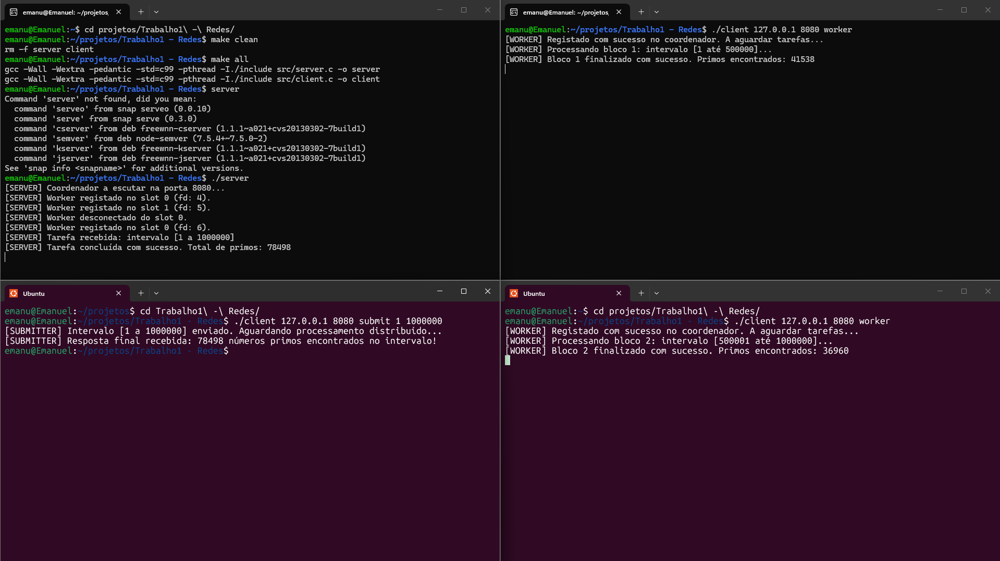

# Sistema Distribuído de Processamento de Tarefas via Sockets TCP

## Membros do Grupo
* Emanuel Percinio Gonçalves de Oliveira, NUSP 13676878

---

## Ambiente de Desenvolvimento e Execução
* **Sistema Operacional:** Ubuntu 24.04.3 LTS (Noble Numbat)
* **Compilador:** gcc (Ubuntu 13.3.0-6ubuntu2~24.04.1) 13.3.0
* **Padrão da Linguagem:** C99 / POSIX.1-2008

---

## Instruções de Compilação
O projeto utiliza um `Makefile` configurado para compilar os módulos do servidor e do cliente utilizando a flag `-pthread` e diretivas de verificação de erros.

Para compilar todo o projeto:
```bash
make
```

Para remover os binários gerados:

```bash
make clean
```

## Instruções de Execução
### 1. Iniciar o Servidor Coordenador
O servidor deve ser iniciado em primeiro lugar, especificando a porta de escuta (padrão: 8080):
```bash
./server 8080
```

### 2. Conectar os Nós Trabalhadores (Workers)
Em terminais distintos (ou máquinas na mesma rede), inicie um ou mais clientes no modo `worker`:

```bash
./client 127.0.0.1 8080 worker
```

### 3. Submeter um Lote de Tarefa (Submitter)
Num novo terminal, submeta um intervalo numérico para contagem de números primos no formato `<INICIO> <FIM>`:

```bash
./client 127.0.0.1 8080 submit 1 1000000
```

## Demonstração de Execução


## Tratamento de Falhas e Verificações Implementadas
Para assegurar a integridade da transmissão e a resiliência do sistema, foram incorporadas as seguintes verificações:

### 1. Reutilização da Porta do Servidor (`SO_REUSEADDR`):

* Configurado via `setsockopt()` para evitar bloqueios de porta (`Address already in use`) caso o servidor seja reiniciado rapidamente.

### 2. Garantia de Transmissão Completa (`send_all` e `recv_all`):

* Em redes TCP orientadas a fluxo (stream), a transmissão de bytes pode ser fragmentada. Foram implementadas funções de encapsulamento com laços de repetição que inspecionam o número total de bytes transferidos, prevenindo a leitura ou o envio de estruturas de dados corrompidas ou incompletas.

### 3. Deteção de Desconexões Abruptas:

* No Servidor: A thread de monitorização de cada trabalhador avalia o retorno de `recv()` utilizando a flag `MSG_PEEK`. Caso a ligação seja interrompida (retorno `<= 0`), o nó é removido do registo de trabalhadores com controlo de concorrência (`pthread_mutex_lock`) sem bloquear o servidor.

* No Trabalhador: Caso a ligação com o coordenador seja perdida a meio do ciclo, o laço de espera é interrompido imediatamente e o socket é fechado graciosamente através de `close()`.

### 4. Tratamento de Falta de Nós Ativos:

* Se um cliente submeter uma tarefa sem nenhum trabalhador conectado, o servidor deteta a indisponibilidade, evita divisões por zero ou travamentos em threads e retorna uma resposta de aviso com contagem zerada.


